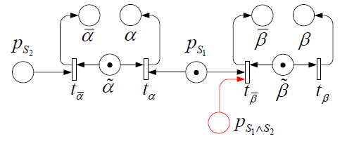
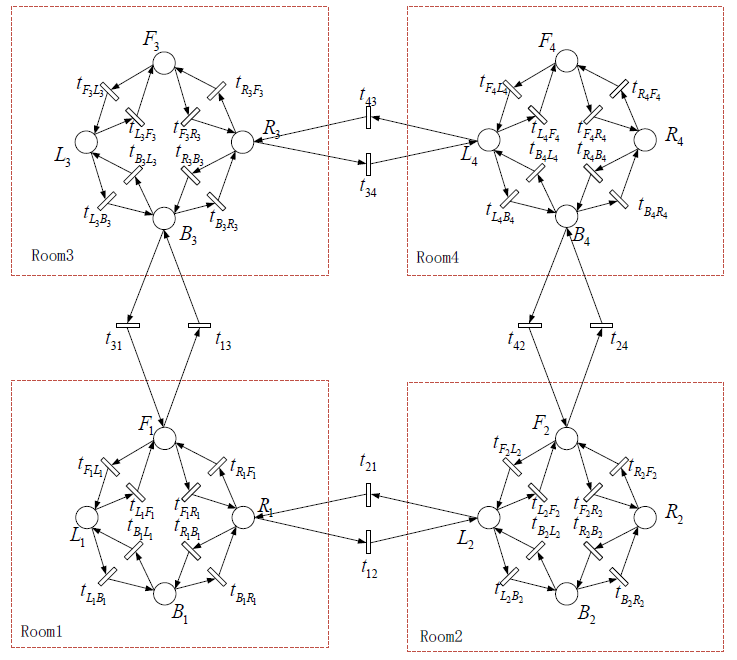
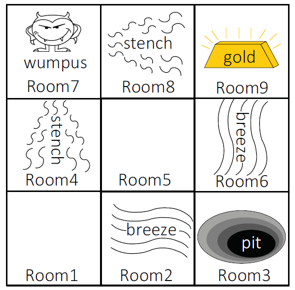
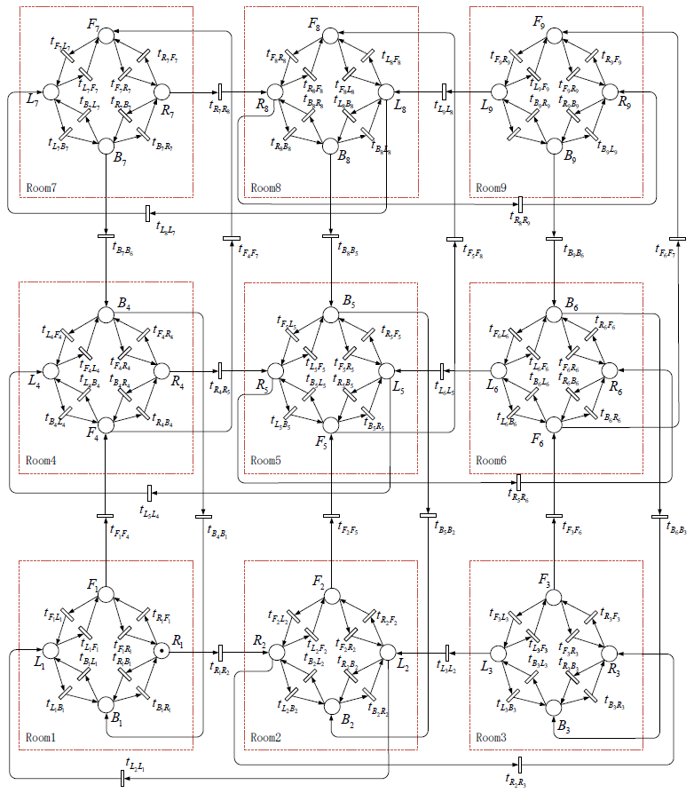
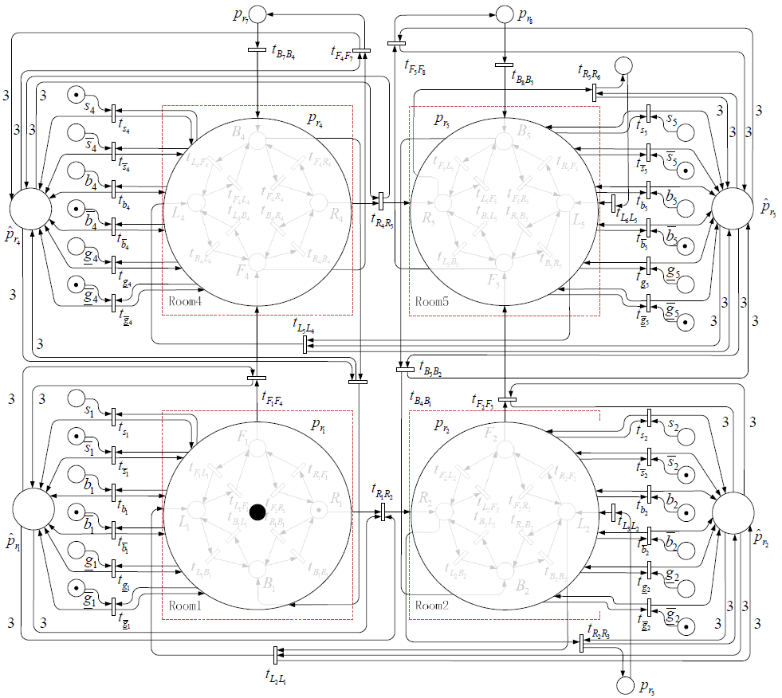
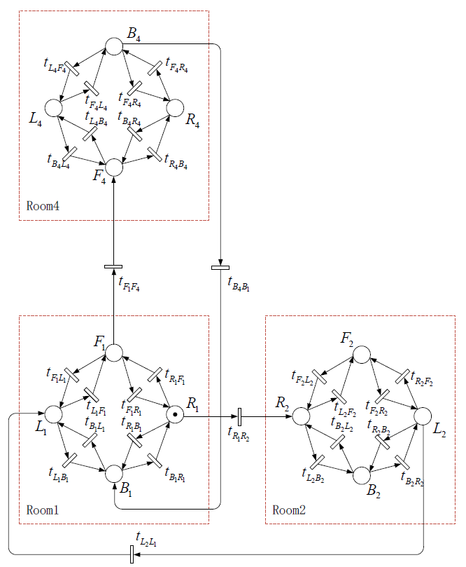
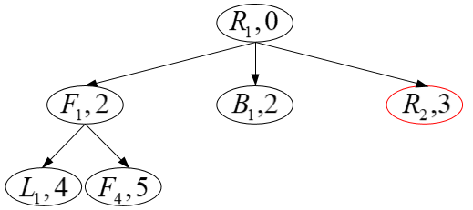

### 2.基础知识

**引理1（归结规则）**：给定两个析取子句，$S_1=l_1 \vee ...\vee l_k$，$S_2 = m_1 \vee ...\vee m_n$。若存在$l_i$和$m_j$是互补符号，当$S_1$和$S_2$做合取时，可得：

​                         $S_1 \wedge S_2=l_1 \vee ...\vee l_{i-1}  \vee l_{i+1} \vee... \vee l_k \vee m_1 \vee ...\vee m_{j-1} \vee m_{j+1} \vee ... \vee m_n$

==最早的出处==

M. Davis, H. Putnam, A computing procedure for quantification theory, J. ACM 7 (3) (1960) 394–397.

J. Robinson, A machine-oriented logic based on the resolution principle, J. ACM 12 (1) (1965) 23–41.

### 3. Inference Algorithms based on Knowledge Petri nets

​        知识库以知识Petri网的形式表示了出来，如何挖掘知识库里隐藏的信息，我们想出的方法是通过知识Petri网来设计推理引擎。知识Petri网将知识库中相互影响的符号以监控库所的方式关联起来，利用这一特点来设计推理算法将极大地提高推理效率。归结规则是一个有效的推理规则，它与任何一个完备的搜索算法相结合时，可以得到完备的推理算法。因此，我们将归结规则与知识Petri网相结合，设计一种新的推理算法。

**定义1**：给定一个知识库$\Pi$和它的知识Petri网$\mathcal{G}_{\Pi}$，$S$是$\Pi$中任意一个析取子句(Clause)  , 为$S$语义约束(Semantic constrain) 设计的监控库所(monitor place) 称为子句库所(Clause place)，记作$p_S$。子句(Clause) S 称为子句库所$p_S$的子句(Clause)。

​        根据引理1，可知归结需要知道子句之间是否存在互补符号，而这正是知识Petri网的一大优点。在知识Petri网中，析取子句根据SPBI方法以子句库所的形式实现，互补符号则对应符号Petri网$\mathcal{G}_{\alpha}$中的库所 $\alpha$ 和 $\bar{\alpha}$。

**定义2**：给定一个知识库$\Pi$和它的知识Petri网$\mathcal{G}_{\Pi}$， $\Sigma_{\Pi}$是$\Pi$的符号集，任意$\alpha \in \Sigma_{\Pi}$，在知识Petri网 $\mathcal{G}_{\Pi}$ 中有与之对应的符号Petri网  $\mathcal{G}_{\alpha}$ 。如果一个子句库所是 $t_{\alpha}$的输入，那么该库所称为 $\alpha$ 的正关联库所，在知识Petri网  $\mathcal{G}_{\Pi}$  中由  $\alpha$ 的全部正关联库所组成的集合称为  $\alpha$ 的正关联库所集 $P_{\alpha,S}$ ；如果一个子句库所是 $t_{\bar{\alpha}}$ 的输入，那么该库所称为  $\alpha$ 的负关联库所，在知识Petri网 $\mathcal{G}_{\Pi}$  中由 $\alpha$  的全部负关联库所组成的集合称为 $\alpha$  的负关联库所集 $\bar P_{\alpha,S}$  ；

**定义3**：给定一个知识库$\Pi$和它的知识Petri网$\mathcal{G}_{\Pi}$， $\Sigma_{\Pi}$是$\Pi$的符号集，任意$\alpha \in \Sigma_{\Pi}$，若 $p_{S_1}$ 是 $\alpha$ 的一个正关联库所，$p_{S_2}$  是 $\alpha$ 的一个负关联库所，则 $(p_{S_1},p_{S_2})$ 是$\alpha$的一个归结结构，$K_\alpha$表示$\alpha$的归结结构的集合。

**定义4**：给定一个知识库$\Pi$和它的知识Petri网$\mathcal{G}_{\Pi}$， $\Sigma_{\Pi}$是$\Pi$的符号集，任意$\alpha \in \Sigma_{\Pi}$， $(p_{S_1},p_{S_2})$ 是$\alpha$的一个归结结构，其中 $p_{S_1}$ , $p_{S_2}$ 的托肯数分别为 $m(p_{S_1})$ , $m(p_{S_2})$ ，输出集  $p_{S_1} {\bullet}=\{t_\alpha, ...\}$， $ p_{S_2} {\bullet}=\{t_{\bar \alpha}, ...\}$  ，可按照下面的操作设计一个库所，该库所称为$S_1$和$S_2$的归结库所，用 $p_{S_1 \wedge S_2}$表示，

1)   $m_0(p_{S_1 \wedge S_2})=m_0(p_{S_1})+m_0(p_{S_2})-1$;

2）  $p_{S_1\wedge S_2} {\bullet}= p_{S_1} {\bullet} + p_{S_2} {\bullet}-\{t_{ \alpha},t_{\bar \alpha} \}，{\bullet}p_{S_1 \wedge S_2}=\varnothing$  .

**定理**1：根据定义4，由归结结构 $(p_{S_1},p_{S_2})$ 设计得到的归结库所 $p_{S_1 \wedge S_2}$ ，和子句$S_1$，$S_2$做归结得到新的子句$S_3$,  $S_3 = S_1 \wedge S_2 $，$S_3$根据语义约束设计的子句库所是相等的，故归结库所  $p_{S_1 \wedge S_2}$  是$S_3$的子句库所 ，$S_3$是 $p_{S_1 \wedge S_2}$ 的子句。

**证明**： 给定一个知识库$\Pi$和它的知识Petri网$\mathcal{G}_{\Pi}$， $\Sigma_{\Pi}$是$\Pi$的符号集，$\alpha $是$\Sigma_{\Pi}$中的一个符号， $p_{S_1}$ , $p_{S_2}$  是子句库所，若$p_{S_1}$ 是 $\alpha$  的正关联库所，$p_{S_2}$ 是 $\alpha$  的负关联库所，则可假设 $p_{S_1}$ 对应的子句为 $S_1 = \bar \alpha \vee l_1 \vee ... \vee l_k$ ，  $p_{S_2}$ 对应的子句为 $S_2 = \alpha \vee m_1 \vee ... \vee m_n$ 。根据知识Petri网的生成算法，可得 $m(p_{S_1})=|\hat \Sigma_{S_1}|-1=k$ ，$m(p_{S_2})=|\hat \Sigma_{S_2}|-1=n$  ，$p_{S_1}{\bullet}=\{t_\alpha,t_{\bar l_1},...,t_{\bar l_k}\}$  ，$p_{S_2}{\bullet}=\{t_\bar \alpha,t_{\bar m_1},...,t_{\bar m_n}\}$  。根据定义4可得，归结结构 $(p_{S_1},p_{S_2})$ 进行归结操作得到$S_1$和$S_2$归结库所  $p_{S_1 \wedge S_2}$，$m(p_{S_1 \wedge S_2})=m(p_{S_1})+m(p_{S_2})-1=k+n-1$，  $\bar p_{c_1\wedge c_2} {\bullet}=\bar p_{c_1} {\bullet} +\bar p_{c_2} {\bullet}-\{t_{ \alpha},t_{\bar \alpha} \}=\{t_{\bar l_1},...,t_{\bar l_k},t_{\bar m_1},...,t_{\bar m_n}\}$ ，${\bullet}p_{S_1 \wedge S_2}=\varnothing$。而根据归结规则，令 $S_3 = S_1 \wedge S_2=( \bar \alpha \vee l_1 \vee ... \vee l_k) \wedge (\alpha \vee m_1 \vee ... \vee m_n)=l_1 \vee ... \vee l_k \vee m_1 \vee ... \vee m_n$ ，根据语义约束设计的$S_3$的子句库所 $p_{S_3}$ ，库所数目 $m(p_{S_3})=|\hat \Sigma_{S_1}|-1=k+m-1$ ， $\bar p_{S_3} {\bullet}=\{t_{\bar l_1},...,t_{\bar l_k},t_{\bar m_1},...,t_{\bar m_n}\}$ ${\bullet}p_{S_3}=\varnothing$，两者对应相等，故归结库所  $p_{S_1 \wedge S_2}$  是$S_3$的子句库所 ，$S_3$是 $p_{S_1 \wedge S_2}$ 的子句。

**定义5**：给定一个知识Petri网和该Petri网中由定义4设计的归结库所$p_{S_1 \wedge S_2}$，若归结库所的输出集$p_{S_1\wedge S_2} {\bullet}$中包含一对对偶变迁(dual transition)，则称该归结库所为冗余归结库所。

**引理2**：在定义5中，冗余归结库所的输出集$p_{S_1\wedge S_2} {\bullet}$中包含一对对偶变迁(dual transition)，则假设冗余归结库所的子句$S_3$为：$S_3=S_1 \wedge S_2=\beta \vee \bar \beta \vee l_1 \vee ...\vee l_k$，$S_3$对应的线性约束不等式为：$\bar \beta + \beta + \bar l_1 + ...+\bar l_k \leq k+1$，又因为$\bar \beta + \beta =1$，上述线性约束不等式可写成：$\bar l_1 + ...+\bar l_k \leq k$。该不等式是恒成立的，故这样的归结库所是没有必要存在的。

​                                                    

​                                                                        图1 知识Petri网中归结结构

​        为了更加形象地理解定义4、5，我们引入一个例子进行说明。如图1所示， 其中，子句库所 $p_{S_1}$ 对应析取子句 $S_1 = \alpha \Rightarrow \beta$ ，子句库所  $p_{S_2}$对应析取子句 $S_2=\beta$。  ,  分别是 $\alpha$ 的正关联库所和负关联库所，根据定义3，将  $(p_{S_1},p_{S_2})$  称为归结结构。根据定义4，可得图中红色部分  $p_{S_1 \wedge S_2}$  ，归结库所的子句为  $\beta$。这与命题逻辑的假言推理规则相一致：当知识库中包含 $\alpha \Rightarrow \beta$ 和 $\alpha$ 这两条先验知识时，我们便可以推理得到 $\beta$ 这个隐藏信息。

​        由此，我们可以给出基于知识Petri网的推理算法。

**算法1** 基于知识Petri网的推理算法

**输入**：知识Petri网  $\mathcal{G}_{\Pi}$，知识库$\Pi$的符号集 $\Sigma_{\Pi}$

**输出**：推理结果的知识库$\Pi^r$，推理完成后的知识Petri网$\mathcal{G}_{\Pi}^r$

1. 令$\Gamma_{r}$储存已经做过归结操作的归结结构，$\Gamma_{\bar r}$储存还未做归结操作的归结结构，$\Pi^r$是储存推理结果的知识库。初始时，$\Gamma_{r}=\varnothing,\Gamma_{\bar r}=\varnothing,\Pi^r = \varnothing$;
2. **for all**  $\alpha \in \Sigma_{\Pi}$  **do**
3. 根据**定义3**，得到 $\alpha$ 的归结结构的集合$K_\alpha$；
4. **for all** $(S_1,S_2)\in K_\alpha$ **do**
5. **if** $(S_1,S_2) \notin \Gamma_{r}$ **then** $\Gamma_{\bar r}= \Gamma_{\bar r} \cup \{(S_1,S_2)\}$
6. **end if** 
7. **end for**
8. **end for**
9. **if** $\Gamma_{\bar r} =\varnothing$ **then** 算法结束，输出推理结果的知识库$\Pi^r$，推理完成后的知识Petri网$\mathcal{G}_{\Pi}^r$
10. **end if**
11. **while** $\Gamma_{\bar r} \neq \varnothing $ **do**
12. 从$\Gamma_{\bar r}$中取出一个归结结构$(S_1,S_2)$，由定义4设计得到$S_1$和$S_2$的归结库所$p_{S_1 \wedge S_2}$。根据定义5和引理2判断该归结库所是否为冗余归结库所，若是，则将其舍去；否则，将其保留，并将归结库所$p_{S_1 \wedge S_2}$的子句$S$添加进$\Pi^r$;
13. 将$(S_1,S_2)$添加进$\Gamma_{r} $，并将$(S_1,S_2)$从$\Gamma_{\bar r} $中删除；
14. **end while**
15. 返回步骤2.

**定义6**：$\mathcal{G}_{\Pi}^r$是$\mathcal{G}_{\Pi}$经过算法1的归结操作得到的，称为知识库$\Pi$的归结Petri网。$\Pi^r$是算法1输出的推理结果的知识库，称为知识库$\Pi$的归结知识库。

**定理2**：算法1设计的推理算法是好的（sound）。

**定理3**：算法1设计的推理算法是完备的（complete）。

**证明**：算法1设计的推理算法是好的且完备的，是因为

​                                           whenever  $S\in \Pi^r$, it also true that $\Pi \models S$   and

​                                           whenever $\Pi\models S$, it also true that $S \in \Pi^r$

​        算法1给出了如何在知识Petri网上进行完备性推理。其中，步骤1是初始化处理；2-8是得到未做过归结操作的归结结构集$\Gamma_{\bar r}$；步骤9-10是算法终止条件的判断，若$\Gamma_{\bar r}$为空，则算法结束，否则，算法继续；步骤11-14主要是取$\Gamma_{\bar r}$中的归结结构按照定义4设计归结库所，并判断设计的归结库所是否为冗余归结库所；步骤15是返回步骤2，进行下一轮的归结处理。

​        在算法1中，主要的计算是寻找归结结构，它的计算复杂度是 $O(n\cdot m^2)$ ，其中 $n$ 表示符号集中符号的个数，$m$  表示算法中出现过的最大的正关联库所集或负关联库所集的大小。对单个符号$\alpha$而言，最坏情况是经过  $m^2$次组合，得到 $m^2$ 个归结结构，一共 $n$ 个符号，所以总的时间复杂度为 $O(n\cdot m^2)$ 。然而，传统的推理方法需要将知识库中的析取子句两两取出判断能否进行归结，最坏的情况下，知识库一共有  $2mn$个析取子句，则需要判断  $C_{2mn}^2 = \frac{2mn\cdot (2mn-1)}{2}=2m^2n^2-mn$次。可见，基于知识Petri网的推理算法能大大减少计算复杂度。

​        算法1得到了知识库$\Pi$的归结Petri网，该Petri网也是知识Petri网，若有新的知识库$\Pi^,$，则可在归结Petri网的基础上继续进行推理。

算法2：基于归结Petri网的推理算法

输入：知识库$\Pi$的归结Petri网$\mathcal{G}_{\Pi}^r$，知识库$\Pi$的归结知识库 $\Pi^r$，知识库$\Pi$的符号集 $\Sigma_{\Pi}$，新的知识库$\Pi^,$

输出：推理结果的知识库$\Pi_n^r$，推理完成后的知识Petri网$\mathcal{G}_{\Pi_n}^r$

1. 令$\Pi_n=\Pi +\Pi^, $表示总的知识库，$\Pi_n^r$是储存由$\Pi_n$进行推理得到的推理结果的知识库，$P_{\bar r}$是储存未进行归结操作的子句库所组成的集合，$\Gamma_{\bar r}$是储存还未做归结操作的归结结构的集合，初始时，$\Pi_n^r = \Pi^r,P_{\bar r}=\varnothing,\Gamma_{\bar r}=\varnothing$;
2. **for all** $S\in \Pi^,$ **do**
3. 根据$S$的语义约束，按照SPBI设计监控库所的方法设计子句库所，将该子句库所添加进$P_{\bar r}$；
4. **end for**
5. **for all** $\alpha \in \Sigma_{\Pi}$ **do**
6. 根据**定义3**，得到$\alpha$的归结结构集$K_\alpha$，令$K_\alpha^,$是$K_\alpha$的子集，$K_\alpha^,=\{(S_1,S_2)|(S_1,S_2) \in K_\alpha \wedge (S_1 \in P_{\bar r} \vee S_2 \in P_{\bar r})$，$\Gamma_{\bar r}=\Gamma_{\bar r}\cup K_\alpha^,$；
7. **end for**
8. $P_{\bar r}=\varnothing$；
9. **if** $\Gamma_{\bar r} =\varnothing$ **then** 算法结束，输出推理结果的知识库$\Pi_n^r$，推理完成后的知识Petri网$\mathcal{G}_{\Pi_n}^r$
10. **end if**
11. **while** $\Gamma_{\bar r} \neq \varnothing $ **do**
12. 从$\Gamma_{\bar r}$中取出一个归结结构$(S_1,S_2)$，并将$(S_1,S_2)$从$\Gamma_{\bar r} $中删除；由定义4设计得到$S_1$和$S_2$的归结库所$p_{S_1 \wedge S_2}$。根据定义5和引理2判断该归结库所是否为冗余归结库所，若是，则将其舍去；否则，将其保留，$P_{\bar r}=P_{\bar r} \cup\{p_{S_1 \wedge S_2}\}$，并将归结库所$p_{S_1 \wedge S_2}$的子句$S$添加进$\Pi_n^r$;
13. **end while**
14. 返回步骤5.

​        算法2与算法1中避免对相同归结结构再次进行归结操作的方法不同，算法1通过保留已经做过归结操作的归结结构来避免重复，算法2是在知识库$\Pi$的归结Petri网$\mathcal{G}_{\Pi}^r$的基础上，由新的知识库继续进行推理，故只需保存还未做归结操作的子句库所的集合$P_{\bar r}$，后续进行归结操作的归结结构$(S_1,S_2)$，$S_1$和$S_2$至少有一个子句库所在$P_\bar r$中，这样就能保证不重复归结。$P_\bar r$一开始是存放$\Pi^,$的子句库所，后存放每一轮归结设计的归结库所。

**定理4**：算法2设计的推理算法是好的（sound）。

**定理5**：算法2设计的推理算法是完备的（complete）。

**证明**：算法2设计的推理算法是好的且完备的，是因为

​                  $\Pi_n=\Pi+\Pi^,$， whenever $S\in \Pi_n^r$, it also true that $\Pi_n \models S$   and

​                                               whenever $\Pi_n\models S$, it also true that $S \in \Pi_n^r$

### 4. Action Planning based on Knowledge bases

​        前面，我们基于知识Petri网开发了一种推理算法，能够推理得到知识库里的隐藏事实。当然，我们的目的不止如此，更希望能实现推理出的信息指导Agent进行合理的行动。有了这样的想法，我们进行了基于知识库的Agent动作规划研究。为了实现Agent的动作规划，需要知道Agent可以采取的动作及相应动作带给Agent的影响。Petri网能够很好地描述离散事件，并且在上一节中知识库是以Petri建模的，若Agent的动作也能以Petri网建模，则有利于将推理与动作规划一体化解决.

#### Agent动作建模

**定义7**：给定一个Agent世界，Agent所能执行的全部动作$a$组成的集合称为Agent的动作库，用$\Lambda$表示.

**定义8：**给定$a\in \Lambda$，Agent在执行动作$a$时会消耗相应的成本，该成本称为动作$a$的代价，用$cost_a$表示.

**定义9**：一个Agent世界由动作库$\Lambda$中的动作的执行而处于不同的状态，这样的状态组成的集合称为Agent的状态集，用$X_\Lambda$表示.

**定义10**：给定一个Agent世界，Agent的动作函数$\phi_\Lambda$表示为：$X_\Lambda\times\Lambda \to X_\Lambda$，在任意状态$x_1$下，执行任意动作$a$，消耗成本$cost_a$，系统到达状态$x_2$，即$x_2=\phi_\Lambda(x_1,a)$。

根据上述定义，当Agent的动作库$\Lambda$、状态集$X_a$、动作函数$\phi_\Lambda$已知时，则可对Agent的动作进行Petri网建模。算法2给出了Agent动作建模算法。

**算法3**： 对Agent动作进行Petri网建模算法

输入：Agent的动作库$\Lambda$，Agent的状态集$X_\Lambda$，Agent的动作函数$\phi_\Lambda$，Agent的初始状态$x_0$

输出：建模得到的动作Petri网$\mathcal{G}_{\Lambda}=(P_{\Lambda},T_{\Lambda},E_{\Lambda},Cost_{\Lambda},m_0)$

1. 初始时，$P_{\Lambda}=X_\Lambda,T_{\Lambda}=\varnothing,E_{\Lambda}=\varnothing,Cost_{\Lambda}=\varnothing,m_0(x_0)=1,m_0(\forall p\in P|p\neq x_0)=0$;
5. **for all** $a \in \Lambda$ **do**
6. 根据定义10，得到该动作$a$在Agent的状态集$X_{\Lambda}$中满足的所有动作函数表达式；
7. 对于每一个动作函数表达式$x_2=\phi_{\Lambda}(x_1,a)$，令$T_{\Lambda}=T_{\Lambda}\cup \{t_{x_1x_2}\}$，$E_{\Lambda}=\{(x_1,t_{x_1x_2}),(t_{x_1x_2},x_2)\}$，$cost(t_{x_1x_2})=cost_a$，$Cost_{\Lambda}=Cost_{\Lambda}\cup\{cost(t_{x_1x_2})\}$;
8. **end for** 
9. 输出动作Petri网$\mathcal{G}_{\Lambda}$.

​        由算法2得到的Agent的动作Petri网，该Petri网只有一个库所中含有一个托肯，其他库所里没有托肯。动作Petri网的标识是由Agent实时所处的状态决定的。Agent处于状态$x$，则在动作Petri网中，库所$x$里有一个托肯，其他库所里没有托肯，该标识对应Agent的状态$x$。

**例1**：$2\times 2$房间的Wumpus世界

​       在Wumpus 世界里，Agent可以做出的动作为：**左转**90°、**右转**90°和**前进到达下一个房间**，分别以$Left,Right$和$Forward$表示，其代价分别表示为$cost_{Left},cost_{Right}$和$cost_{forward}$。在一个房间里，Agent 可能处于的状态有四个：朝前、朝左、朝后和朝右，分别以$F_i,L_i,B_i,R_i(i=1,2,3,4)$表示，$i$为房间号。故Agent的动作库$\Lambda=\{Left,Right,Forward\}$，Agent的状态集$X_\Lambda=\{F_1,L_1,B_1,R_1,F_2,L_2,B_2,R_2,F_3,L_3,B_3,R_3,F_4,L_4,B_4,R_4\}$，各动作满足的动作函数表达示如表?-?所示。

|                         $Left$                         |                         $Right$                         |                         $Forward$                         |
| :----------------------------------------------------: | :-----------------------------------------------------: | :-------------------------------------------------------: |
| $L_i=\phi_{\Lambda}(F_i,Left) $     $i\in\{1,2,3,4\}$  | $R_i=\phi_{\Lambda}(F_i,Right) $     $i\in\{1,2,3,4\}$  | $F_{i+2}=\phi_{\Lambda}(F_i,Forward) $     $i\in\{1,2\}$  |
| $B_i = \phi_{\Lambda}(L_i,Left)$     $i\in\{1,2,3,4\}$ | $B_i=\phi_{\Lambda}(R_i,Right) $     $i\in\{1,2,3,4\}$  | $R_{i+1} = \phi_{\Lambda}(R_i,Forward)$     $i\in\{1,3\}$ |
| $R_i = \phi_{\Lambda}(B_i,Left)$     $i\in\{1,2,3,4\}$ | $L_i = \phi_{\Lambda}(B_i,Right)$     $i\in\{1,2,3,4\}$ | $B_{i-3} = \phi_{\Lambda}(B_i,Forward)$     $i\in\{3,4\}$ |
| $F_i = \phi_{\Lambda}(R_i,Left)$     $i\in\{1,2,3,4\}$ |  $F_i = \phi_\Lambda(L_i,Right)$     $i\in\{1,2,3,4\}$  | $L_{i-1} = \phi_{\Lambda}(L_i,Forward)$     $i\in\{2,4\}$ |

假设初始时，Agent的初始状态为$R_1$，则可根据算法3，得到Agent的动作Petri网$\mathcal{G}_{\Lambda}=(P_{\Lambda},T_{\Lambda},E_{\Lambda},Cost_{\Lambda},m_0)$，如图?-?所示，其中：

$P_{\Lambda}=\{F_1,L_1,B_1,R_1,F_2,L_2,B_2,R_2,F_3,L_3,B_3,R_3,F_4,L_4,B_4,R_4\}$

$T_{\Lambda}=\{t_{F_1 L_1},t_{L_1 B_1},t_{B_1 R_1},t_{R_1 F_1},t_{F_2 L_2},t_{L_2 B_2},t_{B_2 R_2},t_{R_2 F_2},t_{F_3 L_3},t_{L_3 B_3},t_{B_3 R_3},t_{R_3 F_3},t_{F_4 L_4},t_{L_4 B_4},t_{B_4 R_4},t_{R_4 F_4},\\  \quad \quad  \;  \; \; t_{F_1 R_1},t_{R_1 B_1},t_{B_1 L_1},t_{L_1 F_1},t_{F_2 R_2},t_{R_2 B_2},t_{B_2 L_2},t_{L_2 F_2},t_{F_3 R_3},t_{R_3 B_3},t_{B_3 L_3},t_{L_3 F_3},t_{F_4 R_4},t_{R_4 B_4},t_{B_4 L_4},t_{L_4 F_4},\\ \quad \quad  \;  \; \; t_{F_1 F_3},t_{F_2 F_4},t_{R_1 R_2},t_{R_3 R_4},t_{B_3 F_1},t_{B_4 B_2},t_{L_2 L_1},t_{L_4 L_3},\}$

$E_{\Lambda}=\{(F_1,t_{F_1 L_1}),(L_1,t_{L_1 B_1}),(B_1,t_{B_1 R_1}),(R_1,t_{R_1 F_1}),(F_2,t_{F_2 L_2}),(L_2,t_{L_2 B_2}),(B_2,t_{B_2 R_2}),(R_2,t_{R_2 F_2}),\\  \quad \quad  \;  \; \; (F_3,t_{F_3 L_3}),(L_3,t_{L_3 B_3}),(B_3,t_{B_3 R_3}),(R_3,t_{R_3 F_3}),(F_4,t_{F_4 L_4}),(L_4,t_{L_4 B_4}),(B_4,t_{B_4 R_4}),(R_4,t_{R_4 F_4}),\\  \quad \quad  \;  \; \; (F_1,t_{F_1 R_1}),(R_1,t_{R_1 B_1}),(B_1,t_{B_1 L_1}),(L_1,t_{L_1 F_1}),(F_2,t_{F_2 R_2}),(R_2,t_{R_2 B_2}),(B_2,t_{B_2 L_2}),(L_2,t_{L_2 F_2}),\\  \quad \quad  \;  \; \;(F_3,t_{F_3 R_3}),(R_3,t_{R_3 B_3}),(B_3,t_{B_3 L_3}),(L_3,t_{L_3 F_3}),(F_4,t_{F_4 R_4}),(R_4,t_{R_4 B_4}),(B_4,t_{B_4 L_4}),(L_4,t_{L_4 F_4}),\\ \quad \quad  \;  \; \; (F_1,t_{F_1 F_3}),(F_2,t_{F_2 F_4}),(R_1,t_{R_1 R_2}),(R_3,t_{R_3 R_4}),(B_3,t_{B_3 B_1}),(B_4,t_{B_4 B_2}),(L_2,t_{L_2 L_1}),(L_4,t_{L_4 L_3}),\\  \quad \quad  \;  \; \; (t_{F_1 L_1},L_1),(t_{L_1 B_1},B_1),(t_{B_1 R_1},R_1),(t_{R_1 F_1},F_1),(t_{F_2 L_2},L_2),(t_{L_2 B_2},B_2),(t_{B_2 R_2},R_2),(t_{R_2 F_2},F_2),\\  \quad \quad  \;  \; \; (t_{F_3 L_3},L_3),(t_{L_3 B_3},B_3),(t_{B_3 R_3},R_3),(t_{R_3 F_3},F_3),(t_{F_4 L_4},L_4),(t_{L_4 B_4},B_4),(t_{B_4 R_4},R_4),(t_{R_4 F_4},F_4),\\  \quad \quad  \;  \; \; (t_{F_1 R_1},R_1),(t_{R_1 B_1},B_1),(t_{B_1 L_1},L_1),(t_{L_1 F_1},F_1),(t_{F_2 R_2},R_2),(t_{R_2 B_2},B_2),(t_{B_2 L_2},L_2),(t_{L_2 F_2},F_2),\\  \quad \quad  \;  \; \;(t_{F_3 R_3},R_3),(t_{R_3 B_3},B_3),(t_{B_3 L_3},L_3),(t_{L_3 F_3},F_3),(t_{F_4 R_4},R_4),(t_{R_4 B_4},B_4),(t_{B_4 L_4},L_4),(t_{L_4 F_4},F_4),\\ \quad \quad  \;  \; \; (t_{F_1 F_3},F_3),(t_{F_2 F_4},F_4),(t_{R_1 R_2},R_2),(t_{R_3 R_4},R_4),(t_{B_3 B_1},B_1),(t_{B_4 B_2},B_2),(t_{L_2 L_1},L_1),(t_{L_4 L_3},L_3)\}$

$Cost_{\Lambda}=\{cost(t_{F_1 L_1}),cost(t_{L_1 B_1}),cost(t_{B_1 R_1}),cost(t_{R_1 F_1}),cost(t_{F_2 L_2}),cost(t_{L_2 B_2}),cost(t_{B_2 R_2}),cost(t_{R_2 F_2}),\\  \quad \quad \quad \; \; \;  \; \;cost(t_{F_3 L_3}),cost(t_{L_3 B_3}),cost(t_{B_3 R_3}),cost(t_{R_3 F_3}),cost(t_{F_4 L_4}),cost(t_{L_4 B_4}),cost(t_{B_4 R_4}),cost(t_{R_4 F_4}),\\  \quad \quad  \quad \; \;\; \;  \; cost(t_{F_1 R_1}),cost(t_{R_1 B_1}),cost(t_{B_1 L_1}),cost(t_{L_1 F_1}),cost(t_{F_2 R_2}),cost(t_{R_2 B_2}),cost(t_{B_2 L_2}),cost(t_{L_2 F_2}),\\  \quad \quad \quad \; \; \;  \; \;cost(t_{F_3 R_3}),cost(t_{R_3 B_3}),cost(t_{B_3 L_3}),cost(t_{L_3 F_3}),cost(t_{F_4 R_4}),cost(t_{R_4 B_4}),cost(t_{B_4 L_4}),cost(t_{L_4 F_4}),\\ \quad \quad \quad \; \; \;  \; \; cost(t_{F_1 F_3}),cost(t_{F_2 F_4}),cost(t_{R_1 R_2}),cost(t_{R_3 R_4}),cost(t_{B_3 F_1}),cost(t_{B_4 B_2}),cost(t_{L_2 L_1}),cost(t_{L_4 L_3})\}$

$m_0(R_1)=1,m_0(q|q\in P_{\Lambda} \wedge q\neq R_1)=0$

#### 基于动作Petri网的Dijkstra算法

​        根据算法2可以得到Agent的动作模型，而要做动作规划，则需要根据性能指标来评估规划 的动作序列是最优的。性能指标可能是多元的，比如工作时间、动作空间、机械损耗等，本文以代价来总的指代这些。对于Agent的动作库里的动作，每一个动作的执行都需要花销相应的代价，动作规划的目的在于得到一条Agent实现目标且总代价最小的动作序列。本文采取的方法是基于动作Petri网的Dijkstra算法。

**定义11**：给定动作Petri网$\mathcal{G}_{\Lambda}$和任意一个变迁激发序列$\sigma=t_{\sigma_1}t_{\sigma_2}...t_{\sigma_n}$，它的成本记作$C(\sigma_1)=cost(t_{\sigma_1})+cost(t_{\sigma_2})+...+cost(t_{\sigma_n})$.

**定义12**：给定动作Petri网$\mathcal{G}_{\Lambda}$的一个可达标识$m$和到达该标识的变迁激发序列集$L_m$，则由初始标识$m_0$到达$m$的最小到达成本$C_{min}(m)$表示为：$C_{min}(m)=\min \limits_{\sigma\in L_m}C(\sigma)$.

**定义13**：给定动作Petri网$\mathcal{G}_{\Lambda}$的一个可达标识$m$，如果它可以从标识$m^,$一步到达，并且$m^,$是在从初始标识$m_0$到$m$的最小成本序列中，那么$m^,$称为$m$的最小成本父标识，记作$father(m)=m^,$。

**定义13**：给定动作Petri网$\mathcal{G}_{\Lambda}$的一个可达标识$m$，令$node = [m,C_{min}(m),father(m),\check t(m)]$，将$node$称为该动作Petri网$\mathcal{G}_{\Lambda}$的一个状态结点。其中，$C_{min}(m)$为$m$的最小成本，$father(m)$为$m$的最小成本父标识，$\check t(m)$为$m$的最小成本父标识到达$m$激发的变迁，即$father(m)[\check t(m)\rangle m$。

**算法3：**基于动作Petri网可达图的Dijkstra算法

**输入**：动作Petri网$\mathcal{G}_{\Lambda}$，目标标识集$\check M$

**输出**：到达目标标识代价最小的变迁序列$\check T$

1. $m_0$为输入的动作Petri网$\mathcal{G}_{\Lambda}$的初始标识，令当前结点$node=[m,C_{min}(m),father(m),\check t(m)]=[m_0，0，None，None]$
2. 令$list_{open}$存放待扩展的节点，$list_{close}$存放已经扩展的节点，初始时$list_{open}=[node]$，$list_{close}=\varnothing$
3. **while** $m  ∉ \check M$ **do**
4. 将$node$从$list_{open}$中删除，将$node$添加进$list_{close}$
5. 令$T_e=\{\forall t \in T|m\geq C^-(:,t)\}$表示在标识m下使能的变迁集
6. **while** $T_e \neq \varnothing$ **do**
7. 从$T_e$中任意选择一个变迁$t$，并将其从$T_e$中删除
8. $m^,=m-C^-(:,t)+C^+(:,t)，C_{min}(m^,)=C_{min}(m)+cost(t)，father(m^,)=m，\check t(m) =t$
9. 如果 $m^,$已经出现在$list_{close}$的节点中，则返回步骤6
10. 如果 $m^,$已经出现在$list_{open}$的节点中，则判断$C_{min}(m^,)$是否比$list_{open}$里对应节点的小，若是，则更新$C_{min}(m)$和$father(m^,)$，若不是，则不进行操作；否则，将节点$[m^,,C_{min}(m^,),father(m^,),\check t(m)]$添加进$list_{open}$
11. **end while**
12. 将$list_{open}$里的节点按$C_{min}(m)$排序，选出$C_{min}(m)$最小的节点$node_{mincost}$，令$node =[m,\bar {cost}(m),father(m),\check t(m)]= node_{mincost}$
13. **end while**
14. 将$node$添加进$list_{close}$
15. **while** $father(m)\neq None$ **do**
16. 将$\hat t(m)$添加进$\check T$的最前面，令$m=father(m)$
17. **end while**
18. 输出变迁序列$\check T$对应的动作序列

**引理3**：根据算法4输出的动作序列，可实现：

1） Agent由初始状态到达目标状态；

2）该动作序列是在满足Agent从初始状态到达目标状态的所有动作序列中，消耗动作成本最少的。

#### 环境感知Petri网建模​

​        在现实生活中，Agent做动作规划往往需要获取外部环境的信息来推理得到下一个目标集，为了获取这样的环境信息，Agent配置了相应的传感器。Agent在针对感知环境的不同状态下，可以通过自身的传感器获取外部环境的信息，感知信息有助于知识Petri网推理出更多的隐藏事实，指导Agent的动作Petri网进行下一步的动作规划。故需设计环境感知Petri网，将动作Petri网与知识Petri网关联起来。 

**定义14**：给定Agent工作的世界，Agent在不同状态下感知到的环境信息不同，将这样的状态称为Agent基于感知的状态$x_s$，由所有Agent基于感知的状态$x_s$组成的集合称为Agent基于感知的状态集，用$X_s$表示.

**定义15**：给定Agent基于感知的状态集$X_s$，$x_1,x_2 \in X_s$，则在Agent的动作库中，$\exist a \in \Lambda$，使得$x_2=\psi_a(x_1)$，函数$x_2=\psi_a(x_1)$称为感知状态转移函数。

**定义16**：给定一个Agent基于感知的状态$x_s$，Agent在此状态下可以感知到的变量集用$S(x_s)$表示。状态$x_s$的感知子网$\mathcal{G}_{\hat s}=(P_{\hat s},T_{\hat s},E_{\hat s},Weight_{\hat s})$，其中：

1）$P_{\hat s}=\{x_s,\hat x_s\}$，库所$x_s$是由状态$x_s$得到的，库所$\hat x_s$为状态$x_s$的感知收集库所；

2）$T_{\hat s} = \varnothing ,E_{\hat s} = \varnothing,Weight_{\hat s} = \varnothing$；

3）**for all** $v \in S(x_s)$ **do**  

​            $P_{\hat s} = P_{\hat s} \cup \{v,\bar v\}$；

​            $T_{\hat s} = T \cup \{t_v,t_{\hat v}\}$；

​            $E_{\hat s} = E_{\hat s} \cup \{(x_s,t_v),(v,t_v),(t_v,x_s),(t_v,\hat x_s),(x_s,t_{\hat v}),(\bar v,t_{\hat v}),(t_{\hat v},x_s),(t_{\hat v},\hat x_s)\}$；

​      **end for**

4）$Weight_{\hat s}=\{weight(e)=1|e \in E_{\hat s}\}$.

定义16给出了单个Agent基于感知的状态$x_s$的感知Petri网子网，定义15的感知状态转移函数可将这些子网联系起来，得到Agent的环境感知Petri网。

**算法4**：环境感知Petri网的建模算法

**输入**：Agent的动作库$\Lambda$，Agent基于感知的状态集$X_s$

**输出**：环境感知Petri网$\mathcal{G}_{s}$

1. **for all** $x_s \in X_s$ **do**
2. 根据**定义16**设计得到$x_s$的感知子网；
3. **end for**
4. **for all** $a \in \Lambda$ **do**
5. 根据**定义15**得到动作$a$在Agent基于感知的状态集$X_s$中满足的所有状态转移函数；
6. 对于每一个状态转移函数$x_2=\psi_a(x_1)$，设计变迁$t_{x_1x_2}$，$\bullet t_{x_1x_2}=\{x_1,\hat x_1\}$，$t_{x_1x_2} \bullet =\{x_2,\hat x_1\}$，$weight((x_1,t_{x_1x_2}))=1,weight((t_{x_1x_2},x_2))=1$，$weight((\hat x_1,t_{x_1x_2}))=|S(x_s)|，weight((t_{x_1x_2},\hat x_1))=|S(x_s)|$.

​        由算法4得到的Agent的环境感知Petri网，该Petri网的库所中不含托肯，环境感知Petri网的标识是由Agent实时所处的状态决定的。Agent处于状态$x$，则在环境感知Petri网中，库所$x$里有一个托肯，其他库所里没有托肯，该标识对应Agent的状态$x$。由算法4得到的环境感知Petri网$\mathcal{G}_s$，将动作Petri网与知识Petri网关联起来。$\mathcal{G}_s$中存在两类变迁，一类变迁由状态转移函数得到的，它在满足使能的情况下，伴随动作Petri网里的相应变迁激发。另一类为标记变迁，是由感知变量得到的。这一类变迁分别标记了对应感知变量为真或为假成立的信息，它们在满足变迁使能条件时就会激发，同时将标记信息给到知识Petri网。

#### Wumpus World实例

​        以Wumpus世界为例，将推理问题与动作规划问题一体化解决。

​              在文章[1]中得到了Wumpus世界的知识Petri网，本文提出的算法（环境感知Petri网的建模算法）以标记变迁的形式将感知信息以监控库所的方式添加进知识Petri网，作为知识。本文提出的算法（基于知识Petri网的归结算法）可以挖掘知识库里的隐藏事实，获取安全的房间，从而得到Agent基于动作的状态集，由算法2设计Agent的动作Petri网，算法（基于动作Petri网的Dijkstra算法）得到Agent实现下一步探索代价最小的动作序列，从而采取合理的行动进入下一个探索的房间。在下一个探索的房间里又会感知到新的环境信息，继续新的推理与新的动作规划，直至Agent完成任务，找到金矿。

在Wumpus 世界里，Agent可以做出的动作为：**左转**90°、**右转**90°和**前进**到达下一个房间，分别以$Left,Right$和$Forward$表示，其代价分别表示为$cost_{Left},cost_{Right}$和$cost_{forward}$（假定$cost_{Left}=cost_{Right}=2,cost_{forward}=3$）。在一个房间里，Agent 可能处于的状态有四个：朝前、朝左、朝后和朝右，分别以$F_i,L_i,B_i,R_i$表示，$i$为房间号。

动作$Left$ 和 $Right$ 改变Agent的朝向，动作$Forward$ 改变Agent的位置，所有的动作函数如下表所示：

|                            $Left$                            |                           $Right$                            |                          $Forward$                           |
| :----------------------------------------------------------: | :----------------------------------------------------------: | :----------------------------------------------------------: |
| $L_i=\phi_{Left}(F_i,cost_{Left}) $     $i\in[1,2,3,...,9]$  | $R_i=\phi_{Right}(F_i,cost_{Right}) $     $i\in[1,2,3,...,9]$ | $F_{i+3}=\phi_{Forward}(F_i,cost_{Forward}) $     $i\in[1,2,3,4,5,6]$ |
| $B_i = \phi_{Left}(L_i,cost_{Left})$     $i\in[1,2,3,...,9]$ | $B_i=\phi_{Right}(R_i,cost_{Right}) $     $i\in[1,2,3,...,9]$ | $R_{i+1} = \phi_{Forward}(R_i,cost_{Forward})$     $i\in[1,2,4,5,7,8]$ |
| $R_i = \phi_{Left}(B_i,cost_{Left})$     $i\in[1,2,3,...,9]$ | $L_i = \phi_{Right}(B_i,cost_{Right})$     $i\in[1,2,3,...,9]$ | $B_{i-3} = \phi_{Forward}(B_i,cost_{Forward})$     $i\in[4,5,6,7,8,9]$ |
| $F_i = \phi_{Left}(R_i,cost_{Left})$     $i\in[1,2,3,...,9]$ | $F_i = \phi_{Right,cost_{Right}}(L_i)$     $i\in[1,2,3,...,9]$ | $L_{i-1} = \phi_{Forward}(L_i,cost_{Forward})$     $i\in[2,3,5,6,8,9]$ |

假定初始时Agent在1号房间，朝向为朝右，即初始状态为$R_1$，则根据算法2可得到Agent的全局动作Petri$\mathcal{G}_{\Lambda}$如下图所示：

​         对于Agent感知外部环境，感知信息只随Agent的未知发生改变，因此，Agent基于感知的状态集为$X_s=\{P_{r_1},P_{r_2},P_{r_3},P_{r_4},P_{r_5},P_{r_6},P_{r_7},P_{r_8},P_{r_9}\}$，在每一个基于感知的状态下可以感知的变量集为$S(P_{r_i})= \{s_i,b_i,\underline g_i\}$，故根据算法4，可设计Agent的环境感知Petri网如下图所示（只给出了四个房间）：

在本例中，Agent在进行动作规划的时候，需要避开危险的房间和未知的房间，故不能在上面的全局动作Petri网中直接进行Dijkstra算法，而应该由推理结果得出安全的房间，取出Agent基于动作的状态集中满足的状态进行动作Petri网建模。这也说明了Agent的动作规划需要与推理相结合。下面给出Wumpus世界的整个算法。

**算法5**： Wumpus世界

**输入**：知识库$\Pi$，Agent的动作库$\Lambda$，Agent当前所在的房间

**输出**：探索结束

1. 根据文章[?]中的算法1，输入知识库$\Pi$，生成知识Petri网$\mathcal{G}_{\Pi}$；
2. 根据本文的算法3，生成Agent的环境感知Petri网$\mathcal{G}_s$；
3. 由Agent当前所在的房间得到环境感知Petri网的初始标识，在此标识下，标记变迁激发，将相应的感知信息添加进知识Petri网$\mathcal{G}_{\Pi}$；
4. 知识Petri网$\mathcal{G}_{\Pi}$按照本文的算法1归结算法进行推理，得到推理结果；
5. **while** 推理结果没有找到金矿 **do**
6. 根据推理结果得到安全的房间和下一步可探索的房间；
7. 由安全的房间得到满足安全条件的Agent基于动作的状态集，对这部分状态集进行动作Petri网建模；
8. 将动作Petri网和Agent下一步可探索的房间集对应的标识集给到算法3，得到动作Petri网的变迁激发序列，Agent按照该变迁激发序列对应的动作序列执行动作，到达下一个探索的房间。
9. 环境感知Petri网激发相应的变迁，到达与动作Petri网一致的状态，通过标记变迁将该状态下相应的感知信息添加进知识Petri网$\mathcal{G}_{\Pi}$；
10. 知识Petri网$\mathcal{G}_{\Pi}$根据算法1进行推理，得到推理结果；
11. **end while **
12. 输出$Over$. 

算法5给出了Wumpus世界，Agent的运行算法。初始时生成知识Petri网$\mathcal{G}_{\Pi}$，环境感知Petri网$\mathcal{G}_s$。后续运行步骤如下：

1. Agent当前所在的房间为 Room 1，在感知Petri网$\mathcal{G}_{\Upsilon}$中，标记变迁 $t_{\bar s_1},t_{\bar b_1},t_
   {\underline{\bar g}_1}$激发，将$\hat p_1 = \bar s_1,\hat p_2 = \bar b_1, \hat p_3 = \underline{\bar g}_1$添加进知识库$\Pi$，更新知识Petri网$\mathcal{G}_{\Pi}$ ，根据归结算法，得到推理结果$\bar g_1,\bar w_2,\bar p_2,\bar w_4,\bar p_4$，安全的房间为$\{1,2,4\}$，下一步可探索的房间为$\{2,4\}$。满足安全要求的Agent基于动作的状态集为$X_a^s= \{F_1,R_1,B_1,L_1，F_2,R_2,B_2,L_2,F_4,R_4,B_4,L_4\}$，根据算法2得到的动作Petri网$\mathcal{G}_{\Lambda}$如图Figs.?-?所示。在算法3中，输入$\mathcal{G}_{\Lambda}$和目标标识集$\check M= \{F_2,R_2,B_2,L_2,F_4,R_4,B_4,L_4\}$，算法3进行Dijkstra搜索如图所示，得到的变迁激发序列为$\check T = t_{R_1R_2}$，到达目标标识$R_2$，故Agent执行**前进**动作，达到 **Room 2**.

| 当前房间号 |      环境感知Petri网$\mathcal{G}_{\Upsilon}$激发变迁      |                     知识Petri网推理结果                      | 安全的房间号  | 可探索的房间号 |               动作Petri网激发变迁序列                | 到达房间号 |
| :--------: | :-------------------------------------------------------: | :----------------------------------------------------------: | :-----------: | :------------: | :--------------------------------------------------: | :--------: |
|     1      | $t_{\bar s_1},t_{\bar b_1},t_{t_{\bar {\underline g}_1}}$ |        $\bar g_1,\bar w_2,\bar p_2,\bar w_4,\bar p_4$        |     1,2,4     |      2,4       |                     $t_{R_1R_2}$                     |     2      |
|     2      |     $t_{\bar s_2},t_{ b_2},t_{\bar{\underline g_2}}$      | $\bar g_1,\bar w_2,\bar p_2,\bar w_4,\bar p_4,\bar w_1,\bar g_2,\bar w_3,\bar w_5$ |     1,2,4     |       4        | $t_{R_2F_2}t_{F_2L_2}t_{L_2L_1}t_{L_1F_1}t_{F_1F_4}$ |     4      |
|     4      |      $t_{s_4},t_{\bar b_4},t_{\bar{\underline g_4}}$      | $\bar g_1,\bar w_2,\bar p_2,\bar w_4,\bar p_4,\bar w_1,\bar g_2,\bar w_3,\bar w_5,$$ \bar p_1,p_3,\bar g_4,\bar p_5,b_6,\bar p_7, w_7,s_8$ |    1,2,4,5    |       5        |                $t_{F_4R_4}t_{R_4R_5}$                |     5      |
|     5      |   $t_{\bar s_5},t_{\bar b_5},t_{\bar{\underline g_5}}$    | $\bar g_1,\bar w_2,\bar p_2,\bar w_4,\bar p_4,\bar w_1,\bar g_2,\bar w_3,\bar w_5,$$ \bar p_1,p_3,\bar g_4,\bar p_5,b_6,\bar p_7, w_7,s_8,\bar s_3,\bar b_3,\bar g_5,$$\bar w_6,\bar p_6,\bar s_7,\bar b_7,\bar w_8,\bar p_8,\bar s_9,\bar p_9$ |  1,2,4,5,6,8  |      6,8       |                     $t_{R_5R_6}$                     |     6      |
|     6      |     $t_{\bar s_6},t_{ b_6},t_{\bar{\underline g_6}}$      | $\bar g_1,\bar w_2,\bar p_2,\bar w_4,\bar p_4,\bar w_1,\bar g_2,\bar w_3,\bar w_5,$$ \bar p_1,p_3,\bar g_4,\bar p_5,b_6,\bar p_7, w_7,s_8,\bar s_3,\bar b_3,\bar g_5,$$\bar w_6,\bar p_6,\bar s_7,\bar b_7,\bar w_8,\bar p_8,\bar s_9,\bar p_9,\bar g_6,\bar w_9$ |  1,2,4,5,6,8  |       8        | $t_{R_6F_6}t_{F_6L_6}t_{L_6L_5}t_{L_5F_5}t_{F_5F_8}$ |     8      |
|     8      |     $t_{ s_8},t_{\bar b_8},t_{\bar{\underline g_8}}$      | $\bar g_1,\bar w_2,\bar p_2,\bar w_4,\bar p_4,\bar w_1,\bar g_2,\bar w_3,\bar w_5,$$ \bar p_1,p_3,\bar g_4,\bar p_5,b_6,\bar p_7, w_7,s_8,\bar s_3,\bar b_3,\bar g_5,$$\bar w_6,\bar p_6,\bar s_7,\bar b_7,\bar w_8,\bar p_8,\bar s_9,\bar p_9,\bar g_6,\bar w_9,\bar g_8,\bar p_9$ | 1,2,4,5,6,8,9 |       9        |                 ${F_8R_8}t_{R_8R_9}$                 |     9      |
|     9      |      $t_{\bar s_9},t_{\bar b_9},t_{\underline g_9}$       | $\bar g_1,\bar w_2,\bar p_2,\bar w_4,\bar p_4,\bar w_1,\bar g_2,\bar w_3,\bar w_5,$$ \bar p_1,p_3,\bar g_4,\bar p_5,b_6,\bar p_7, w_7,s_8,\bar s_3,\bar b_3,\bar g_5,$$\bar w_6,\bar p_6,\bar s_7,\bar b_7,\bar w_8,\bar p_8,\bar s_9,\bar p_9,\bar g_6,\bar w_9,\bar g_8,\bar p_9, g_9$ |      ---      |      ---       |                         ---                          |    ---     |

